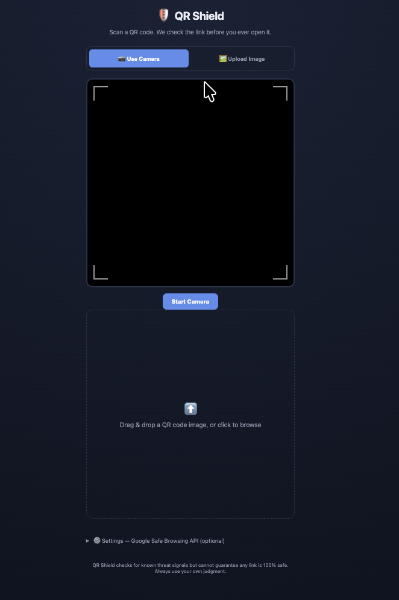

# 🛡️ QR Shield

**Scan a QR code. We check the link before you ever open it.**

QR Shield is a browser-based tool that scans QR codes (via camera or uploaded image) and analyzes the embedded link for common phishing / malware ("quishing") signals **before** you tap into it. Safe-looking links glow **green** and can be opened directly; suspicious ones glow **red** and are blocked behind a confirmation step.

[Live demo](https://sydney-o-connor.github.io/qr-shield/)



## Why

QR code phishing has spiked — fake parking meter stickers, mailed "package delivery" scams, malicious restaurant menu codes. Most people scan first and think second. QR Shield flips that order.

## How it works

1. **Scan** — live camera scan (`jsQR`) or drag-and-drop an image of a QR code
2. **Local heuristic checks** (instant, no API key, works offline) — flags:
   - Non-HTTPS links
   - Raw IP addresses instead of domain names
   - Known URL shorteners (which hide the real destination)
   - Punycode / homograph lookalike domains
   - Suspicious/high-abuse TLDs
   - Excessive subdomains (e.g. `paypal.com.secure-login.xyz`)
   - Common phishing keywords in the URL
   - `@` symbol URL-disguise tricks
3. **Optional live threat-database check** — if you add your own free [Google Safe Browsing API key](https://developers.google.com/safe-browsing/v4/get-started) in Settings, links are also checked against Google's real-time malware/phishing database
4. **Verdict** — green glow + direct open button if nothing was flagged, red glow + blocked click (with an explicit "I understand the risk" override) if something was

## ⚠️ Important limitations — please read

- **Green does not mean "guaranteed safe."** It means nothing suspicious was found by these specific checks. A newly-registered phishing site can be flagged by nothing yet, anywhere, until someone reports it.
- The local heuristics are pattern-based and **will have false positives and false negatives**. They're a first line of defense, not a verdict.
- This is a side/portfolio project, not a production security product — please don't rely on it for anything high-stakes.

## Getting started

No build step, no dependencies to install. Just:

```bash
git clone https://github.com/sydney-o-connor/qr-shield.git
cd qr-shield
```

Then open `index.html` in a browser, or serve it locally (camera access requires either `localhost` or HTTPS):

```bash
python3 -m http.server 8000
# then visit http://localhost:8000
```

### Enabling live Safe Browsing checks (optional)

1. Get a free API key: https://developers.google.com/safe-browsing/v4/get-started
2. In the app, open **⚙️ Settings** at the bottom, paste your key, and click **Save Key**
3. The key is stored only in your browser's `localStorage` — it's never sent anywhere except Google's API

## Project structure

```
qr-shield/
├── index.html          # App shell / markup
├── css/
│   └── style.css       # All styling, incl. green/red glow states
├── js/
│   ├── app.js           # Camera/upload wiring + result rendering
│   ├── heuristics.js     # Local offline URL-analysis logic
│   └── safeBrowsing.js   # Optional Google Safe Browsing integration
└── assets/               # Screenshots etc.
```

## Roadmap ideas

- [ ] Redirect-chain following (unwrap shortened URLs to see the real final destination)
- [ ] Domain age lookup (WHOIS) as an additional signal
- [ ] Scan history (local only)
- [ ] PWA support for "install as app" on mobile
- [ ] Batch-check mode for auditing multiple printed QR codes at once

## Contributing

PRs welcome — especially more heuristic signals, or plugging in additional free threat-intel APIs (VirusTotal, PhishTank, urlscan.io).

## License

MIT — see [LICENSE](LICENSE).
